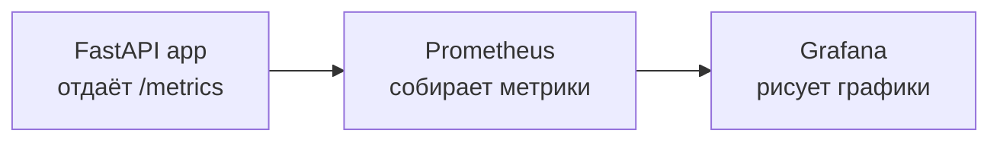
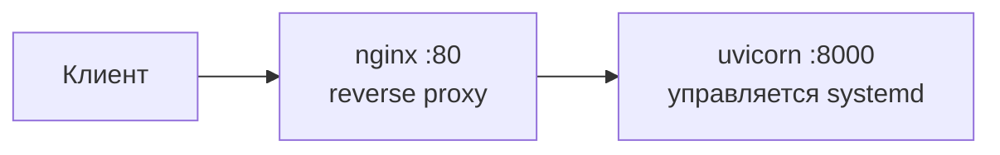

# DevOps Monitoring Platform


Учебный pet-проект, демонстрирующий полный цикл мониторинга приложения: сбор системных метрик, их хранение и визуализацию. Проект можно поднять двумя способами — через Docker Compose (быстрый старт) или как bare-metal сервис на Linux-сервере через systemd и nginx (продовый сценарий без контейнеров). Сборка и тесты проверяются в CI на каждый push.

Проект собирался для практики ключевых инструментов DevOps: контейнеризации, оркестрации, мониторинга (Prometheus + Grafana), автоматизации проверок (CI), bare-metal деплоя (systemd, nginx, bash) и конфигурации как кода (provisioning Grafana, шаблонизация systemd-юнита).

## Что внутри

- **FastAPI-приложение**, которое измеряет загрузку CPU и оперативной памяти хоста через `psutil` и отдаёт метрики в двух форматах: человекочитаемом JSON и формате Prometheus.
- **Prometheus**, который по расписанию опрашивает приложение и хранит метрики.
- **Grafana** с предварительно настроенным (через provisioning) источником данных и готовым дашбордом — графики видны сразу после запуска, без ручной настройки.
- **Bare-metal деплой**: systemd-сервис для запуска приложения без Docker, nginx как reverse proxy перед ним, и bash-скрипт автодеплоя с healthcheck.
- **Тесты** на `pytest` и линтер `flake8`.
- **CI на GitHub Actions**: проверка стиля кода, прогон тестов и сборка Docker-образа на каждый push и pull request.

## Архитектура

**Docker-сценарий:**



Все три сервиса работают в одной сети Docker (`devops-net`) и обращаются друг к другу по имени контейнера. Prometheus сам ходит на эндпоинт `/metrics` приложения и забирает данные (pull-модель), Grafana запрашивает их у Prometheus.

**Bare-metal сценарий:**



nginx принимает запросы на 80-м порту и проксирует их на приложение, которое слушает только `127.0.0.1:8000` и снаружи недоступно напрямую. Эндпоинт `/metrics` дополнительно закрыт правилом `deny all` — снаружи отдаёт 403, изнутри сервера доступен.

## Стек технологий

| Слой | Технологии |
|------|------------|
| Приложение | Python, FastAPI, psutil, prometheus-client |
| Мониторинг | Prometheus, Grafana |
| Контейнеризация | Docker, Docker Compose |
| Bare-metal деплой | systemd, nginx, bash, envsubst |
| Тесты и качество | pytest, flake8 |
| CI/CD | GitHub Actions |

## Структура проекта

```
.
├── app/
│   ├── main.py                     # FastAPI-приложение, метрики CPU и RAM
│   └── requirements.txt
├── docker/
│   └── Dockerfile                  # сборка образа приложения
├── compose/
│   └── docker-compose.yml          # оркестрация: app + prometheus + grafana
├── monitoring/
│   ├── prometheus.yml              # конфиг Prometheus (что и где опрашивать)
│   └── grafana/
│       ├── provisioning/
│       │   ├── datasources/        # автоподключение Prometheus как источника
│       │   └── dashboards/         # провайдер дашбордов
│       └── dashboards/             # сам дашборд (System metrics)
├── deploy/                         # bare-metal деплой: systemd + nginx + автодеплой
│   ├── config.env                  # единственное место с юзером/путём/портом для конкретной машины
│   ├── app.service.template        # шаблон systemd unit с плейсхолдерами ${APP_USER} и т.д.
│   ├── install-service.sh          # разовая установка systemd-сервиса (envsubst → unit-файл)
│   ├── install-nginx.sh            # разовая установка и настройка nginx reverse proxy
│   ├── deploy.sh                   # регулярное обновление кода (git pull + restart + healthcheck)
│   └── nginx/
│       └── app.conf                # конфиг reverse proxy
├── tests/
│   └── test_app.py                 # тесты эндпоинтов
└── .github/workflows/ci.yml        # пайплайн CI
```

## Способы запуска

### 1. Docker (быстрый старт)

Требуется установленный Docker с Docker Compose.

```bash
git clone https://github.com/Arteeemm/devops-monitoring-platform.git
cd devops-monitoring-platform/compose
docker compose up --build
```

После запуска доступны:

| Сервис | Адрес | Назначение |
|--------|-------|------------|
| Приложение | http://localhost:8000/system | JSON с текущей загрузкой CPU и памяти |
| Приложение | http://localhost:8000/metrics | метрики в формате Prometheus |
| Prometheus | http://localhost:9090 | хранилище метрик и поиск по ним |
| Grafana | http://localhost:3000 | дашборды (логин по умолчанию `admin` / `admin`) |

В Grafana дашборд **System metrics** уже на месте: раздел Dashboards → System metrics. Графики начинают заполняться через одну-две минуты после запуска (интервал опроса Prometheus по умолчанию — 1 минута).

### 2. Bare-metal на Linux-сервере (systemd + nginx)

Альтернатива Docker — запуск приложения напрямую на VM через systemd, с nginx как reverse proxy перед ним. Подходит для практики администрирования Linux без контейнеров.

**Шаг 1 — клонировать репозиторий и подготовить окружение:**

```bash
git clone https://github.com/Arteeemm/devops-monitoring-platform.git
cd devops-monitoring-platform
sudo apt update && sudo apt install python3.10-venv gettext-base -y
python3 -m venv venv
source venv/bin/activate
pip install -r app/requirements.txt
deactivate
```

**Шаг 2 — настроить `deploy/config.env`** под текущую машину (единственное место, которое нужно менять при переезде на новый сервер):

```bash
APP_USER=<имя_пользователя>      # узнать через whoami
APP_DIR=/home/<имя_пользователя>/devops-monitoring-platform
APP_PORT=8000
```

**Шаг 3 — установить systemd-сервис:**

```bash
chmod +x deploy/install-service.sh
./deploy/install-service.sh
sudo systemctl status app.service   # должен быть active (running)
```

Скрипт собирает `app.service.template` через `envsubst` (подставляет значения из `config.env`), копирует готовый unit-файл в `/etc/systemd/system/` и перезапускает сервис. Приложение работает от обычного пользователя, а не от root — намеренно, по принципу наименьших привилегий.

**Шаг 4 — установить nginx как reverse proxy:**

```bash
chmod +x deploy/install-nginx.sh
./deploy/install-nginx.sh
```

После этого приложение доступно через порт 80 (`curl localhost/system`), а порт 8000 проброшен только на `127.0.0.1` — снаружи недоступен напрямую.

**Шаг 5 — закрыть firewall, оставив только нужные порты:**

```bash
sudo ufw allow 80/tcp
sudo ufw allow OpenSSH
sudo ufw enable
```

**Обновление кода** на уже настроенном сервере — одна команда:

```bash
chmod +x deploy/deploy.sh
bash deploy/deploy.sh
```

`deploy.sh` сам определяет текущую git-ветку, делает `git pull`, переустанавливает зависимости только если изменился `requirements.txt`, перезапускает сервис и проверяет через `curl`, что приложение действительно отвечает — результат каждого запуска пишется в `deploy/deploy.log`.

## Эндпоинты приложения

| Метод | Путь | Описание |
|-------|------|----------|
| GET | `/system` | Возвращает JSON вида `{"cpu_percent": ..., "memory_percent": ...}` |
| GET | `/metrics` | Возвращает те же метрики в формате, который понимает Prometheus |

Экспортируемые метрики: `system_cpu_percent`, `system_memory_percent`.

## CI

Пайплайн (`.github/workflows/ci.yml`) запускается на каждый push и pull request в ветку `main` и выполняет:

1. **Линтинг** кода через `flake8`.
2. **Прогон тестов** через `pytest`.
3. **Сборку Docker-образа** приложения.

Так каждое изменение автоматически проверяется на стиль, корректность и собираемость.

## Возможные доработки

Идеи, куда проект можно развивать дальше:

- автоматизировать установку через Ansible (один playbook вместо набора bash-скриптов);
- добавить алертинг через Alertmanager (уведомления при превышении порогов);
- расширить набор метрик (диск, сеть) или подключить `node_exporter`;
- настроить push Docker-образа в registry на этапе CI и/или автодеплой по SSH при пуше в `main` (Continuous Deployment);
- добавить персистентные тома для данных Prometheus и Grafana;
- настроить HTTPS в nginx (Let's Encrypt) при наличии домена;
- зафиксировать версии зависимостей для воспроизводимости сборки.
