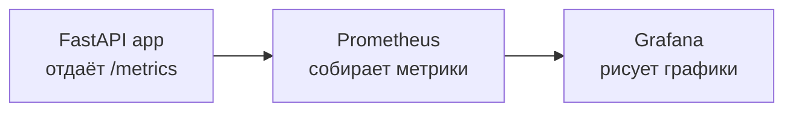

# DevOps Monitoring Platform


Учебный pet-проект, демонстрирующий полный цикл мониторинга приложения: сбор системных метрик, их хранение и визуализацию. Весь стек поднимается одной командой через Docker Compose, а сборка проверяется в CI на каждый push.

Проект собирался для практики ключевых инструментов DevOps: контейнеризации, оркестрации, мониторинга (Prometheus + Grafana), автоматизации проверок (CI) и конфигурации как кода (provisioning Grafana).

## Что внутри

- **FastAPI-приложение**, которое измеряет загрузку CPU и оперативной памяти хоста через `psutil` и отдаёт метрики в двух форматах: человекочитаемом JSON и формате Prometheus.
- **Prometheus**, который по расписанию опрашивает приложение и хранит метрики.
- **Grafana** с предварительно настроенным (через provisioning) источником данных и готовым дашбордом — графики видны сразу после запуска, без ручной настройки.
- **Тесты** на `pytest` и линтер `flake8`.
- **CI на GitHub Actions**: проверка стиля кода, прогон тестов и сборка Docker-образа на каждый push и pull request.

## Архитектура



Все три сервиса работают в одной сети Docker (`devops-net`) и обращаются друг к другу по имени контейнера. Prometheus сам ходит на эндпоинт `/metrics` приложения и забирает данные (pull-модель), Grafana запрашивает их у Prometheus.

## Стек технологий

| Слой | Технологии |
|------|------------|
| Приложение | Python, FastAPI, psutil, prometheus-client |
| Мониторинг | Prometheus, Grafana |
| Контейнеризация | Docker, Docker Compose |
| Тесты и качество | pytest, flake8 |
| CI/CD | GitHub Actions |

## Структура проекта

```
.
├── app/
│   ├── main.py                 # FastAPI-приложение, метрики CPU и RAM
│   └── requirements.txt
├── docker/
│   └── Dockerfile              # сборка образа приложения
├── compose/
│   └── docker-compose.yml      # оркестрация: app + prometheus + grafana
├── monitoring/
│   ├── prometheus.yml          # конфиг Prometheus (что и где опрашивать)
│   └── grafana/
│       ├── provisioning/
│       │   ├── datasources/    # автоподключение Prometheus как источника
│       │   └── dashboards/     # провайдер дашбордов
│       └── dashboards/         # сам дашборд (System metrics)
├── tests/
│   └── test_app.py             # тесты эндпоинтов
└── .github/workflows/ci.yml    # пайплайн CI
```

## Быстрый старт

Требуется установленный Docker с Docker Compose.

```bash
git clone https://github.com/Arteeemm/devops-monitoring-platform.git
cd devops-monitoring-platform/compose
docker compose up --build
```

После запуска доступны:

| Сервис | Адрес | Назначение |
|--------|-------|------------|
| Приложение | http://localhost:8000/system | JSON с текущей загрузкой CPU и памяти |
| Приложение | http://localhost:8000/metrics | метрики в формате Prometheus |
| Prometheus | http://localhost:9090 | хранилище метрик и поиск по ним |
| Grafana | http://localhost:3000 | дашборды (логин по умолчанию `admin` / `admin`) |

В Grafana дашборд **System metrics** уже на месте: раздел Dashboards → System metrics. Графики начинают заполняться через одну-две минуты после запуска (интервал опроса Prometheus по умолчанию — 1 минута).

## Эндпоинты приложения

| Метод | Путь | Описание |
|-------|------|----------|
| GET | `/system` | Возвращает JSON вида `{"cpu_percent": ..., "memory_percent": ...}` |
| GET | `/metrics` | Возвращает те же метрики в формате, который понимает Prometheus |

Экспортируемые метрики: `system_cpu_percent`, `system_memory_percent`.

## CI

Пайплайн (`.github/workflows/ci.yml`) запускается на каждый push и pull request в ветку `main` и выполняет:

1. **Линтинг** кода через `flake8`.
2. **Прогон тестов** через `pytest`.
3. **Сборку Docker-образа** приложения.

Так каждое изменение автоматически проверяется на стиль, корректность и собираемость.

## Возможные доработки

Идеи, куда проект можно развивать дальше:

- добавить алертинг через Alertmanager (уведомления при превышении порогов);
- расширить набор метрик (диск, сеть) или подключить `node_exporter`;
- настроить push Docker-образа в registry на этапе CI;
- добавить персистентные тома для данных Prometheus и Grafana;
- зафиксировать версии зависимостей для воспроизводимости сборки.
